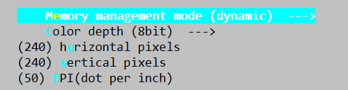
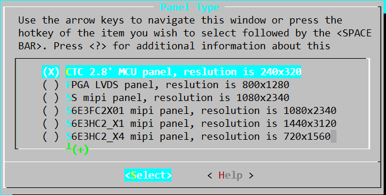

# **Rockchip Developer Guide** Application Demo

发布版本：1.0.0

作者邮箱：chad.ma@rock-chips.com

日期：2019.09

文件密级：公开资料

**前言**

**概述**

**产品版本**

| **芯片名称** | **RT Thread 版本** |
| ------------ | ----------------- |
| RK2108       | v3.1.3 及以上      |

**读者对象**

本文档（本指南）主要适用于以下工程师：
技术支持工程师
软件开发工程师

**修订记录**

| **日期**   | **版本** | **作者** | **修改说明** |
| ---------- | -------- | -------- | ------------ |
| 2019-09-06 | V1.0.0   | chad.ma  | 初始发布     |

<div style="page-break-after: always;"></div>
## 目录

[TOC]

<div style="page-break-after: always;"></div>
## 1 概述

本文介绍了Rockchip 应用实例基于 RT-Thread 实现的ASR语音唤醒功能(思必驰语音固件）、并结合ASR语音唤醒功能实现带屏显示语音唤醒交互结果的功能。

通过本文介绍的应用实例，开发者可了解并掌握关于Rockchip RT-Thread开发平台的基于语音唤醒功能、带显示的应用使用功能，以便参考。

<div style="page-break-after: always;"></div>
## 2 ASR应用实例

### 2.1 代码路径

```
./applications/
├── rk_iot_app/asr
```

### 2.2 固件及内存地址配置

使用思必驰固件需要进行配置，其他固件可跳过本节。

#### 2.2.1替换固件

思必驰固件分为两个部分，其他固件仅有rkdsp_fw.h文件，因此需要将rkdsp_fw.h文件替换。

```
bsp/rockchip/rk2108/dsp_fw/rkdsp_fw_speech.h
bsp/rockchip/rk2108/Image/ext_rkdsp.bin
```

其中ext_rkdsp.bin将作为系统固件一部分，随系统固件一起打包进Firmware。

使用bsp/rockchip/rk2108/dsp_fw/rkdsp_fw_speech.h替换bsp/rockchip/rk2108/dsp_fw/rkdsp_fw.h，并保持使用rkdsp_fw.h名称不变。

#### 2.2.2 修改board.h

由于思必驰固件较大，需要使用部分SRAM，因此将CPU可用内存缩小，修改bsp/rockchip/rk2108/board/<EVB board >[^1]/board.h：

```c
- #define RK_SRAM_END             0x20100000
+ #define RK_SRAM_END             0x200E0000
```

注[^1]:<EVB board>这里根据具体使用的EVB板型修改对应的目录

#### 2.2.3 替换setting.ini

使用bsp/rockchip/rk2108/Image/setting_speech.ini替换bsp/rockchip/rk2108/Image/setting.ini，并保持setting.ini名称不变。

### 2.3 配置说明

bsp/rockchip/rk2108目录下，执行scons --menuconfig

- 开启DSP配置

```
> RT-Thread rockchip rk2108 drivers > Enable DSP >
[*] Enable DSP
[*]   Enable firmware loader to dsp
        Dsp firmware path (Store firmware data in builtin)  --->
[ ]   Enable dsp send trace to cm4
(0)   Config dsp debug uart port
```

这里dsp debug uart的port配置根据实际使用中调试串口端口保持一致。

若这里使用uart0作为M4调试端口，DSP同样也需配置成端口0，否则无法接收DSP端的调试信息。

- 开启codec（即其中标注**的项，下同）

```
> RT-Thread rockchip rk2108 drivers > Enable Audio > Enable Audio Card >
[*] Audio Cards
[ ]   Enable internal adc audio card
[ ]   Enable digital mic audio card
[ ]   Enable audio pwm audio card
[*]   Enable es8388 audio card    **
```

~~~
> RT-Thread rockchip rk2108 drivers > Enable Audio >
[*] Enable PCM
[ ] Enable AUDIOPWM
[*] Enable I2STDM       **
[ ]   Enable I2STDM0
[*]   Enable I2STDM1    **
[ ] Enable PDM
[*] Enable VAD
        VAD irq handler (handled by DSP)  --->
    Enable Audio Card  --->
    Enable Codec  --->
~~~

- 开启app

```
> RT-Thread application
[*] rk iot app
[*]   system info save to flash
[ ]   network and wlan enable
Select asr wake up mode (use speech wake up words)  --->
[ ]   dsp get data through vad path
```

- 开启mp3解码器

```
> RT-Thread Components > Audio Plugin >
[*] Enable mp3 decoder
[ ] Enable speex encoder
[ ] Enable amr codec
[ ] Enable player test
```

- 开启AMIC

```
> RT-Thread rockchip rk2108 drivers > Enable Audio > Enable Audio Card >
[*] Audio Cards
[*]   Enable internal adc audio card    **
[ ]   Enable digital mic audio card
[ ]   Enable audio pwm audio card
[*]   Enable es8388 audio card
```

```
> RT-Thread rockchip rk2108 drivers > Enable Audio >
[*] Enable PCM
[ ] Enable AUDIOPWM
[*] Enable I2STDM
[*]   Enable I2STDM0    **
[*]   Enable I2STDM1
[ ] Enable PDM
[*] Enable VAD
        VAD irq handler (handled by DSP)  --->
    Enable Audio Card  --->
    Enable Codec  --->
```

- 开启PDM MIC（与AMIC二选一配置即可）

```
> RT-Thread rockchip rk2108 drivers > Enable Audio > Enable Audio Card >
[*] Audio Cards
[ ]   Enable internal adc audio card
[*]   Enable digital mic audio card    **
        mic type (Enable pdm mic audio card)  --->  **
[ ]   Enable audio pwm audio card
[*]   Enable es8388 audio card
```

```
> RT-Thread rockchip rk2108 drivers > Enable Audio >
[*] Enable PCM
[ ] Enable AUDIOPWM
[*] Enable I2STDM
[ ]   Enable I2STDM0
[*]   Enable I2STDM1
-*- Enable PDM       **
[*]   Enable PDM0    **
[*] Enable VAD
        VAD irq handler (handled by DSP)  --->
    Enable Audio Card  --->
    Enable Codec  --->
```

- 关闭VOP、RGB

~~~
> RT-Thread rockchip rk2108 drivers >
[*] Enable CRU
-*- Enable General DMA Framework
[*]   Enable PL330 DMA Controller
[*] Enable PMU
[ ] Enable RGB    **
[ ] Enable VOP    **
[ ] Enable MIPI DSI
[ ] Enable KEYCTRL
[*] Enable PWM0
    Enable DSP  --->
    Enable UART  --->
    Enable I2C  --->
    Enable SPI  --->
    Enable Audio  --->
[ ] Enable SYSTICK
~~~

### 2.4 配置唤醒通路

#### 2.4.1 使用VAD通路

VAD通路与CM4通路区别在于DSP直接从VAD获取数据，CM4仅做配置，无法获取到数据。需要使用CM4通路请直接参考 [2.4.2 使用CM4通路](# 2.4.2 使用CM4通路)。

##### 2.4.1.1 应用配置ASR通路

应用配置中打开vad path

```
> RT-Thread application
[*] rk iot app
[*]   dsp get data through vad path        **
```

##### 2.4.1.2  开启声卡VAD功能

```
> RT-Thread rockchip rk2108 drivers > Enable Audio >
[*] Enable PCM
[*] Enable VAD        **
        VAD irq handler (handled by DSP)  --->
    Enable Audio Card  --->
    Enable Codec  --->
```

#### 2.4.2 使用CM4通路

##### 2.4.2.1 应用配置ASR通路

关闭application中dsp get data through vad path配置。

```
> RT-Thread application
[*] rk iot app
[ ]   dsp get data through vad path             **
```

##### 2.4.2.2 关闭声卡VAD功能

关闭VAD配置

```
> RT-Thread rockchip rk2108 drivers > Enable Audio >
[*] Enable PCM
[ ] Enable AUDIOPWM
[*] Enable I2STDM
[ ]   Enable I2STDM0
[*]   Enable I2STDM1
-*- Enable PDM
[*]   Enable PDM0
[ ] Enable VAD    **
    Enable Audio Card  --->
    Enable Codec  --->
```

### 2.5 声卡接口说明

声卡接口具体实现在`bsp/rockchip/common/drivers/audio/rk_audio.c`，使用示例可参考`bsp/rockchip/common/tests/tinyplay.c`和`bsp/rockchip/common/tests/tinycap.c`。

#### 2.5.1 接口说明

rk_audio.c文件内接口不能直接调用，而是通过RT-Thread Audio设备框架进行调用，相关接口有：

| 接口名称| 用途 |
| ------------------------------------------------------------ | ------------------------------- |
| rt_device_t rt_device_find(const char* name);                | 根据 Audio 设备名称获取设备句柄 |
| rt_err_t rt_device_open(rt_device_t dev, rt_uint16_t oflags); | 通过设备句柄打开或关闭设备      |
| rt_err_t rt_device_control(rt_device_t dev, rt_uint8_t cmd, void* arg); | 通过设备句柄操作设备 |
| rt_size_t rt_device_write(rt_device_t dev, rt_off_t pos, const void* buffer, rt_size_t size); | 写入音频数据 |
| rt_size_t rt_device_read(rt_device_t dev, rt_off_t pos, void* buffer, rt_size_t size); | 获取音频数据 |
|rt_err_t rt_device_close(rt_device_t dev); | 关闭音频设备 |

接口详细说明请查看RT-Thread官方文档 [Audio设备篇](https://www.rt-thread.org/document/site/programming-manual/device/audio/audio/)。

#### 2.5.2 注意事项

音频读写所需环形内存由调用者维护，即需要调用者申请内存，并在使用结束后释放，申请或释放需要使用`rt_malloc_uncache`和`rt_free_uncache`接口，使用其他接口申请的内存可能会因为读写速度的影响导致声音卡顿。

读写音频数据时传入的`size`为帧大小，与bytes的关系为`frames = bytes / (bits >> 3 * channels)`，例如16bits、2ch的情况下，帧字节数为2048，则读写时传递的size应为`2048 / (16 >> 3 * 2) = 512`。

<div style="page-break-after: always;"></div>
## 3 Display应用实例

### 3.1 代码路径

```
./applications/
├── rk_iot_app
├── rk_iot_display
```

### 3.2  配置说明

显示实例相关配置如下：

**进入工程目录，执行menuconfig命令：**

```
usr@host:~/path to sdk/$ cd bsp/rockchip/rk2108/
usr@host:~/path to sdk/bsp/rockchip/rk2108$ scons --menuconfig
```

- **LittlevGL组件的配置：**

```
Location:
  -> RT-Thread Components
      -> System
         -> LittlevGL2RTT: The LittlevGl gui lib adapter RT-Thread (RT_USING_LITTLEVGL2RTT [=y])
            -> LittlevGL2RTT Component Options
```

具体配置如上图所示：使用MCU屏，配置成宽高240*240像素，8bit色深。



按照以下配置，选择240x320 MCU屏幕:

```
Location:
    -> RT-Thread rockchip common drivers
        Panel Type (CTC 2.8' MCU panel, reslution is 240x320)  --->
```

需先配置RGB与VOP相关驱动。



- **相关驱动配置**：

```
-> RT-Thread rockchip rk2108 drivers
    [*] Enable RGB
    [*] Enable VOP
```


因io复用的关系，若使用显示功能需关闭codec相关的配置。

- **关闭codec：**

```
> RT-Thread rockchip rk2108 drivers
    > Enable Audio  --->
        Enable Audio Card  --->
            [ ]   Enable es8388 audio card
```

- **版型配置**：

```
-> RT-Thread board config
    -> Board Type
        (X) Enable RK2108B_EVB board
```

- **ASR唤醒通路配置：**

```
-> RT-Thread rockchip rk2108 drivers
    [*] Enable PCM
    [*] Enable I2STDM
    [*]   Enable I2STDM0
        Enable Audio Card  --->
        [*] Audio Cards
        [*]   Enable internal adc audio card
        [ ]   Enable digital mic audio card
        [ ]   Enable es8388 audio card
```

- **开启app：**

```
-> RT-Thread application
[*] IoT display enable
[*] rk iot app
```

### 3.3  代码配置

本文中显示实例使用CM4唤醒通路。具体参考 [2.4.2 使用CM4通路](# 2.4.2 使用CM4通路)

### 3.4 应用开机启动

RT-Thread 开机启动应用的代码在applications/start_app/application.c中，test_thread_entry接口。

<div style="page-break-after: always;"></div>
## 4 文件系统打包

将脚本mkroot.sh放至bsp/rockchip/rk2108目录下，执行./mkroot.sh，即会在Image目录下生产root.img文件。

该脚本将bsp/rockchip/rk2108/resource/userdata目录下的文件或目录制作成Fat12格式的文件系统，大小为setting.ini中设定的Flash Totalsize 减去root字段的偏移地址。

<div style="page-break-after: always;"></div>
## 5 固件烧录

| 地址       | 名称        | 文件                       |
| ---------- | ----------- | -------------------------- |
| 0x00000000 | LoaderToDDR | Image/rk2108_db_loader.bin |
| 0x00000000 | firmware    | Image/Firmware.img         |
| 0x00001100 | root        | Image/root.img             |

注：文件系统仅需烧写一次，后续可以只烧写loader和Firmware。

​       root.img 在Display实例中可不烧录。

<div style="page-break-after: always;"></div>
## 6 运行测试

固件烧录成功，运行启动，对着EVB板说出如下命令词：（思必驰固件）

```
"xiao you xiao you" ,
"da kai re shui qi" ,
"guan bi re shui qi" ,
"tiao gao wen du" ,
"tiao di wen du" ,
"si shi wu du" ,
"liu shi wu du" ,
"qi shi wu du" ,
"da kai yi jun" ,
"guan bi yi jun" ,
"da kai chen yu" ,
"guan bi chen yu" ,
"da kai wan yu" ,
"guan bi wan yu" ,
"wo yao xi zao" ,
"da kai su re bu shui" ,
"guan bi su re bu shui",
```

可看到经过DSP处理，并成功唤醒后在ASR实例中会播放如下内容的应答提示音；

在显示应用实例中，在MCU显示屏上显示如下内容的应答字符。

    "我在/在的/请吩咐/您请说" (随机出现)
    "已为您打开热水器",
    "已为您关闭热水器",
    "已为您调高温度",
    "已为您调低温度",
    "已为您调至45°",
    "已为您调至65°",
    "已为您调至75°",
    "已为您打开抑菌",
    "已为您关闭抑菌",
    "已为您打开晨浴",
    "已为您关闭晨浴",
    "已为您打开晚浴",
    "已为您关闭晚浴",
    "好的,已为您打开热水器",
    "已为您打开速热补水",
    "已为您关闭速热补水",
<div style="page-break-after: always;"></div>
## 7 参考文档

1. [Rockchip_Developer_Guide_RT-Thread_Display_CN.md](../driver/display/Rockchip_Developer_Guide_RT-Thread_Display_CN.md)
2. [Rockchip_Developer_Guide_RT-Thread_Display_APP_CN.md](./Rockchip_Developer_Guide_RT-Thread_Display_APP_CN.md)