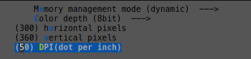
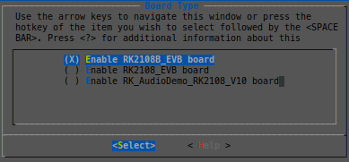
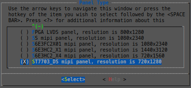
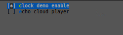
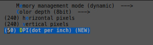
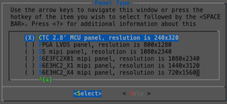
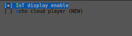

# Rockchip  Display 应用开发指南

文件标识：RK-KF-YF-342

发布版本：V1.2.0

日期：2020-05-08

文件密级：□绝密   □秘密   □内部资料   ■公开

---

**免责声明**

本文档按“现状”提供，福州瑞芯微电子股份有限公司（“本公司”，下同）不对本文档的任何陈述、信息和内容的准确性、可靠性、完整性、适销性、特定目的性和非侵权性提供任何明示或暗示的声明或保证。本文档仅作为使用指导的参考。

由于产品版本升级或其他原因，本文档将可能在未经任何通知的情况下，不定期进行更新或修改。

**商标声明**

“Rockchip”、“瑞芯微”、“瑞芯”均为本公司的注册商标，归本公司所有。

本文档可能提及的其他所有注册商标或商标，由其各自拥有者所有。

**版权所有** **© 2019** **福州瑞芯微电子股份有限公司**

超越合理使用范畴，非经本公司书面许可，任何单位和个人不得擅自摘抄、复制本文档内容的部分或全部，并不得以任何形式传播。

福州瑞芯微电子股份有限公司

Fuzhou Rockchip Electronics Co., Ltd.

地址：     福建省福州市铜盘路软件园A区18号

网址：     [www.rock-chips.com](http://www.rock-chips.com)

客户服务电话： +86-4007-700-590

客户服务传真： +86-591-83951833

客户服务邮箱： [fae@rock-chips.com](mailto:fae@rock-chips.com)

---

**前言**

**概述**

本文通过几个简单的用例，向开发者提供了关于Rockchip RT-Thread开发平台的显示应用参考。

**产品版本**

| **芯片名称** | **内核版本** |
| ------------ | ------------ |
| RK2108       | RT-Thread V3.1.3 |

**读者对象**

本文档（本指南）主要适用于以下工程师：

技术支持工程师
软件开发工程师

**修订记录**

| **版本号** | **作者** | **修改日期** | **修改说明** |
| ---------- | --------| :--------- | ------------ |
| V1.0.0    | 郑永智 | 2019-09-20 | 初始版本     |
| V1.1.0    | 郑永智 | 2019-03-09 | 文档格式整理     |
| V1.2.0 | 钟勇汪 | 2020-05-08 | 修改编译命令 |

**目录**

---
[TOC]
---

## 1 基于 720x1280 屏幕的clock demo用例

### 1.1 代码路径

基于 720x1280 屏幕的clock demo用例代码路径为：

```shell
.
├── applications
    └── clock
```

### 1.2 工程配置

通过以下简单配置开启该用例的配置。

1）进入工程目录，执行menuconfig命令

```shell
usr@host:~/rt-thread$ cd bsp/rockchip/rk2108/
usr@host:~/rt-thread/bsp/rockchip/rk2108$ scons --menuconfig
```

2）LittlevGL组件的配置

```shell
Location:
  -> RT-Thread Components
      -> System
         -> LittlevGL2RTT: The LittlevGl gui lib adapter RT-Thread (RT_USING_LITTLEVGL2RTT [=y])
            -> LittlevGL2RTT Component Options
```

按照以下信息配置LittlevGL GUI:



3）开发板配置

```shell
Location:
    -> RT-Thread board config
```

按照以下信息选择开发板配置：



4）Pannel配置

```shell
Location:
    -> RT-Thread rockchip common drivers
```

按照以下配置，选择720x1280屏幕：



5）显示应用配置

```shell
Location:
    -> RT-Thread application
```

按照以下配置，打开“clock demo enable”配置：



### 1.3 编译与执行

配置完成之后，在工程目录下执行编译命令：

```shell
usr@host:~/rt-thread/bsp/rockchip/rk2108$ ./build.sh
```

编译完成之后将固件下载到开发板查看显示效果。

## 2 基于 240x320 屏幕的RK_IoT_Display显示用例

### 2.1 代码路径

基于 240x320 屏幕的RK_IoT_Display用例代码路径为：

```shell
.
├── applications
    └── rk_iot_display
```

### 2.2 工程配置

通过以下简单配置开启该用例的配置：

1） 进入工程目录，执行menuconfig命令

```shell
usr@host:~/rt-thread$ cd bsp/rockchip/rk2108/
usr@host:~/rt-thread/bsp/rockchip/rk2108$ scons --menuconfig

```

2）LittlevGL组件的配置

```shell
Location:
  -> RT-Thread Components
      -> System
         -> LittlevGL2RTT: The LittlevGl gui lib adapter RT-Thread (RT_USING_LITTLEVGL2RTT [=y])
            -> LittlevGL2RTT Component Options
```

按照以下信息配置LittlevGL GUI：



3）开发板配置

```shell
Location:
    -> RT-Thread board config
```

按照以下信息选择开发板配置：


4）Pannel配置

```shell
Location:
    -> RT-Thread rockchip common drivers
```

按照以下配置，选择240x320屏幕



5）显示应用配置

```shell
Location:
    -> RT-Thread application
```

按照以下配置，打开“IoT display enable”配置



### 2.3 编译与执行

配置完成之后，在工程目录下执行编译命令：

```shell
usr@host:~/rt-thread/bsp/rockchip/rk2108$ ./build.sh
```

编译完成之后将固件下载到开发板查看显示效果。

## 3 参考文档

1. [LittlevGL GUI 参考文献](https://littlevgl.com/)
