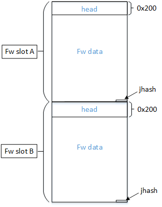
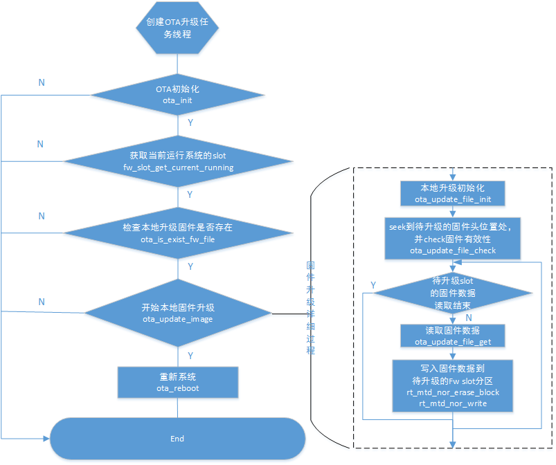

# RT-Thread OTA升级开发指南

文件标识：RK-KF-YF-354

发布版本：V1.2.0

日期：2020-08-10

文件密级：□绝密   □秘密   □内部资料   ■公开

**免责声明**

本文档按“现状”提供，瑞芯微电子股份有限公司（“本公司”，下同）不对本文档的任何陈述、信息和内容的准确性、可靠性、完整性、适销性、特定目的性和非侵权性提供任何明示或暗示的声明或保证。本文档仅作为使用指导的参考。

由于产品版本升级或其他原因，本文档将可能在未经任何通知的情况下，不定期进行更新或修改。

**商标声明**

“Rockchip”、“瑞芯微”、“瑞芯”均为本公司的注册商标，归本公司所有。

本文档可能提及的其他所有注册商标或商标，由其各自拥有者所有。

**版权所有 © 2020 瑞芯微电子股份有限公司**

超越合理使用范畴，非经本公司书面许可，任何单位和个人不得擅自摘抄、复制本文档内容的部分或全部，并不得以任何形式传播。

瑞芯微电子股份有限公司

Rockchip Electronics Co., Ltd.

地址：     福建省福州市铜盘路软件园A区18号

网址：     [www.rock-chips.com](http://www.rock-chips.com)

客户服务电话： +86-4007-700-590

客户服务传真： +86-591-83951833

客户服务邮箱： [fae@rock-chips.com](mailto:fae@rock-chips.com)

---

**前言**

**概述**

本文介绍了基于 rtthread 系统，固件 OTA 升级的开发流程与相关配置。

**产品版本**

| **芯片名称** | **内核版本** |
| ------------ | ------------ |
| RK2108    | RT-Thread 3.1.3 |

**读者对象**

本文档（本指南）主要适用于以下工程师：

技术支持工程师

软件开发工程师

**修订记录**

| **版本号** | **作者** | **修改日期** | **修改说明** |
| ---------- | --------| :--------- | ------------ |
| V1.0.0    | 马龙昌 | 2020-02-20 | 初始版本     |
| V1.0.1 | 陈谋春 | 2020-03-05 | 调整“接口说明”的样式 |
| V1.1.0 | 马龙昌 | 2020-03-31 | 更新2.2、2.3小节 |
| V1.2.0 | 马龙昌 | 2020-08-10 | 调整文档样式，更新第2、3章节内容 |

---

**目录**

[TOC]

---

## OTA概述

OTA 模块为系统提供设备端本地或在线升级固件的功能。此文档用以解释说明 OTA 模块相关概念和定义，介绍并指导开发者使用 SDK 中的 OTA 方案。OTA 模块的开发需要开发者了解固件分区结构，相关的内容可以参考文档《RK2206_Firmware_Structure_User_Guide.pdf》。

### OTA升级原理

RK2108 RT-Thread SDK 中的 OTA 采用A/B系统更新的方案，也称为无缝更新，类似 Android 系统的OTA升级。A/B 升级确保可运行的启动系统在 OTA 更新期间能够保留在 Flash 上。这样就降低更新之后设备无法启动的可能性，也就是说，用户需要将设备送到维修/保修中心进行更换和刷机的情况将有所减少。

用户在 OTA 期间可以继续使用设备。即使 OTA 失败，设备也仍然可以使用，因为它会启动到 OTA 之前的固件分区。用户可以再次尝试下载 OTA。A/B 系统方案的固件结构简单示意图如下所示：



两个 Firmware 固件均有三部分构成，Firmware head 头部结构信息、Firmware data 固件数据、Firmware jhash 该固件分区的 jhash 校验值。固件区域应该与 Flash 可擦除块对齐。Firmware Head 大小为512字节，记录了Firmware 的相关信息。该部分的详细说明见后面章节。Firmware data 是可执行的程序与数据。Firmware jhash 是对Firmware head 与Firmware data 做的哈希计算结果，大小为4个字节。

实际需要 OTA 升级时，会检测当前运行在哪个 Fw slot，从当前运行的固件 slot 去升级另外一个固件 slot。升级成功后，并校验通过，将激活已升级的 Fw slot，系统软复位后尝试从已激活的升级过的 Fw slot 启动系统，若成功启动，标记该 slot 为成功启动；若启动失败，标记为不可启动状态，并尝试从另外一个 Fw slot 启动（回到升级前）系统。

系统首先从 Fw slot A 分区加载程序与数据，根据配置选择从本地或通过网络更新另外一个 Fw slot 的固件数据。

### 相关概念与定义

#### OTA protocol

`OTA protocol` 表示 OTA 升级时下载固件的协议。在 `ota.h` 中定义如下：

```c
typedef enum ota_protocol {
    OTA_PROTOCOL_FILE   = 0,
    OTA_PROTOCOL_HTTP   = 1,
} ota_protocol;
```

其中`OTA_PROTOCOL_FILE` 表示从文件升级，即本地升级，将制作好的升级包 `Firmware.img` 放在某一存储介质中（如 SD 卡，eMMc Flash 等），调用升级接口写入固件分区进行本地升级。升级成功后，可删除升级包。

`OTA_PROTOCOL_HTTP` 表示通过 http 协议升级，即下载升级，通过http协议获取到 Firmware.img 的升级包数据然后写入固件分区升级。

#### OTA verify

OTA verify 表示对下载完固件的校验算法。为保证固件在 OTA 下载和升级 Flash 过程中不出错，采用 Jhash 算法对固件进行校验。

```c
typedef enum ota_verify {
    OTA_VERIFY_NONE     = 0,
    OTA_VERIFY_JHASH    = 1,
} ota_verify;
```

哈希校验的接口在 `Fwupdate.c` 中定义如下：

```c
unsigned int jshash(unsigned int hash, char *str, unsigned int len)
```

#### Firmware header结构体

```c
typedef struct _FIRMWARE_HEADER
{
	unsigned char  magic[8]; //'RESC'
	unsigned char  chip[16];
	unsigned char  model[32];
	unsigned char  desc[16]; //description
	STRUCT_VERSION version;
	STRUCT_DATE release_date;
	unsigned int data_offset; //raw firmware offset
	unsigned int data_size;  //raw firmware size
	unsigned char  reserved1[4];
	unsigned char  digest_flag; //digest algorithm,default is 1(js_hash)
	unsigned char  reserved2[421];
}FIRMWARE_HEADER, *PFIRMWARE_HEADER;//head is 512 bytes
```

## 接口使用说明

### 代码位置

OTA 相关代码请参考：

`Path_to_SDK/components/ota/`

```bash
.
├── Kconfig
├── link_queue.c
├── link_queue.h
├── ota.c
├── ota_file.c
├── ota_file.h
├── ota.h
├── ota_http.c
├── ota_http.h
├── ota_opt.h
├── rkdebug.h
└── SConscript
```

### 接口说明

下面简要说明 OTA 模块提供的接口。

- 初始化 OTA 模块的私有全局参数结构体指针。根据当前正在运行的系统固件信息初始化image分区的大小，当前正在运行的分区编号、以及需要升级的分区的起始地址。

```c
ota_status ota_init(void)
```

- 反初始化 OTA 模块。

```c
void ota_deinit(void)
```

- 通过指定协议下载固件。输入参数 protocol 为所选择的下载固件的协议。输入参数 url 为固件统一资源定位符。下载成功，返回 `OTA_STATUS_OK`；下载失败，返回 `OTA_STATUS_ERROR`。

```c
ota_status ota_update_image(ota_protocol protocol, void *url)
```

- 通过指定算法校验下载的固件，输入参数 verify 为指定的校验算法。校验成功返回 `OTA_STATUS_OK`；校验失败返回 `OTA_STATUS_ERROR`。

```c
ota_status ota_verify_img(ota_verify verify)
```

- 重启系统。输入参数为升级的Fw slot 索引。

```c
void ota_reboot(int system_running)
```

- 系统分区A/B slot数据的校验。

```c
rt_bool_t fw_ab_data_verify(fw_ab_data *src, fw_ab_data *dest)
```

- 系统分区A/B slot 相关标志的数据初始化。

```c
void fw_ab_data_init(fw_ab_data *data)
```

- 系统分区A/B slot 相关数据的写入，将AB系统启动相关数据写入`AB_DATA_PART_OFFSET`指定的Flash区域。

```c
int fw_ab_data_write(const fw_ab_data *data)
```

- 判断系统分区A/B slot是否为可启动状态。

```c
rt_bool_t fw_slot_is_bootable(fw_ab_slot_data *slot)
```

- 读取系统分区A/B slot 相关数据。将AB系统启动相关数据从`AB_DATA_PART_OFFSET`指定的Flash区域读入到指定数据结构中。

```c
int fw_ab_data_read(fw_ab_data *data)
```

- 根据指定的系统分区 Fw slot 索引设置 Fw slot的标志为挂起态。

```c
int fw_slot_set_pending(uint32_t slot)
```

- 重置指定系统分区 Fw slot 的标志

```c
int fw_slot_reset_flag(uint32_t slot)
```

- 打印当前系统运行的系统分区 slot AB标识的状态与用户分区 slot AB标识的转态

```c
void fw_slot_info_dump(void)
```

- 根据指定的系统分区 Fw slot 索引设置Fw slot的标志为激活态。

```c
int fw_slot_set_active(uint32_t slot)
```

- 获取当前正在运行的系统分区是哪个slot。

```c
int fw_slot_get_current_running(uint32_t* cur_slot)
```

- 用户分区 A/B slot 相关标志的数据初始化。

```c
void user_ab_data_init(user_ab_data *data)
```

- 用户分区 A/B slot 数据的校验。

```c
rt_bool_t user_ab_data_verify(user_ab_data *src, user_ab_data *dest)
```

- 用户分区数据的写入，将 AB 用户启动相关数据写入`USER_AB_DATA_OFFSET`指定的Flash区域。

```c
int user_ab_data_write(const user_ab_data *data)
```

- 判断用户分区A/B slot是否为可启动状态。

```c
rt_bool_t user_slot_is_bootable(user_ab_slot_data *slot)
```

- 读取用户分区 A/B slot 相关数据。将AB系统使用的相关数据从`USER_AB_DATA_OFFSET`指定的Flash区域读入到指定数据结构中。

```c
int user_ab_data_read(user_ab_data *data)
```

- 重置指定用户分区 user slot 的标志

```c
int user_slot_reset_flag(uint32_t slot)
```

- 根据指定的用户分区 slot 索引设置该 slot分区的标志为挂起态。

```c
int user_slot_set_pending(uint32_t slot)
```

- 根据指定的用户分区 slot 索引设置该slot分区的标志为激活态。

```c
int user_slot_set_active(uint32_t slot)
```

### 使用示例

#### 本地升级

假设固件存放在 eMMC Flash 中，且挂载的路径为`/sdcard`，固件路径path为`“/sdcard/Firmware.img”`。

相关配置如下：

- AB固件模式，OTA 相关配置：

```bash
-> RT-Thread Components
    [*] Enable Ota upgrade
          OTA Component Options  --->
              [ ] Enable ota upgrade in recovery mode
              OTA upgrade from where (local)  --->    #本地选择升级选择Local，在线升级选择http
              [ ]   Enable support root A/B partition #若支持用户分区AB升级，打开该项配置
-*- Enable firmware analysis
```

本地升级流程如下图所示：



- recovery 固件模式下，OTA 相关配置：

```bash
-> RT-Thread Components
    [*] Enable Ota upgrade
          OTA Component Options  --->
              [*] Enable ota upgrade in recovery mode
              OTA upgrade from where (local)  --->
```

升级流程参考本地升级流程图。

注意：

- recovery 固件升级模式下，支持在 slot A 升级 slot B 。升级完成后重启进入 slot B，即 recovery 模式下执行升级流程。

- 在 slot B 模式下完成了对 slot A 固件分区的升级后，若存在其他需要升级的分区，一并升级。如DSP固件分区（固件数据指定放在type为data的分区），完成升级后需要回读校验或版本信息的校验。

- 在升级固件 slot A 或 slot B 分区之前，要复位将要升级分区的标志：成功标志 `success_boot`，尝试启动剩余次数 `tries_remaining` 标志。

- 在启动 slot  A 或者 slot  B 分区成功后，要写入这个分区的成功启动标志：`success_boot`。

- 在从固件 slot A 跳转到固件 slot B 之前，要检查是 slot  B 的成功标志和尝试启动剩余次数 `tries_remaining` 标志，如果 `success_boot` 等于0且 `tries_remaining` 等于0，则不做跳到 slot B。此意味着 slot B不能成功启动。

- 在从固件 slot B 跳到固件 slot A 之前，要检查 slot A 的 `success_boot`  和 `tries_remaining` 标志，如果 `success_boot` 等于0且 `tries_remaining`等于0，则将设备重启跳到 maskrom 设备模式下，此意味着 slot A不能成功启动，固件分区数据被破坏，需要重新烧写系统固件。

#### 在线升级

在线升级是指升级固件存放在远程某个http 服务器中，通过指定升级固件的URL下载来升级固件的方式。

OTA相关配置：

```bash
-> RT-Thread Components
    [*] Enable http
    [*] Enable Ota upgrade
          OTA Component Options  --->
              [ ] Enable ota upgrade in recovery mode
              OTA upgrade from where (http)  --->    #本地选择升级选择Local，在线升级选择http
              [ ]   Enable support root A/B partition #若支持用户分区AB升级，打开该项配置
              (http://172.16.21.157/rk2108-Firmware.img) Url of firmware from http server
-*- Enable firmware analysis
```

在线升级的前提是需要设备连接上Wi-Fi。

`http://172.16.21.157/rk2108-Firmware.img` 此处配置的是服务器端升级包的URL地址。

在线升级流程如下图所示：


## 固件编译与生成

### 编译固件

根据支持AB固件与否，选择不同的编译固件的执行方式。

#### 编译AB固件

```shell
cd Path_to_SDK/bsp/rockchip/rk2108

./build.sh
```

若使用`scons --menuconfig`过程中遇到如下问题：

```bash
scons --menuconfig
scons: Reading SConscript files ...
ImportError: No module named configparser:
 File "/home/chris/data/home/chris/2108/release/bsp/rockchip/rk2108/SConstruct", line 11:
  from buildutil import *
 File "/home/2108/release/bsp/rockchip/rk2108/../tools/buildutil.py", line 2: import configparser
```

请执行一下命令，安装`python-configparser`包

```shell
sudo apt-get install python-configparser
```

执行成功后即生成可烧录与 OTA 升级的固件 Firmware.img。

#### 编译非AB固件（recovery模式升级固件）

非AB固件升级主要是基于某些方面的考虑，如成本，Flash 容量等。固件的组成结构与AB固件类似，不过第二份固件只是打包了运行在`SRAM`中`OTA`升级相关的接口与必须的驱动代码，是通过使用特殊配置，编译出来的非XIP方式的固件，其大小较小，仅不到200K左右，因为这种方式跟`Linux` `recovery`升级方式类似，我们也可以称之为`recovery`升级模式。

使用`recovery`模式，单固件编译的方式如下：

```
cd Path_to_SDK/bsp/rockchip/rk2108

./build-recovery.sh
```

`./build-recovery.sh`中使用`./board/common/recovery_defconfig`作为第二份固件的默认配置，该配置中关闭了XIP。